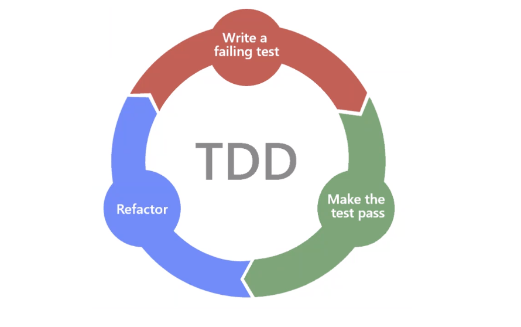

# TDD (Test Driven Development)
TDD is a practice where you create the test 1st and then the code in order to pass those tests.

## Type of testing
- Unit Testing
- TDD

## Modules to help test code
- pytest (``` pip install pytest```) in terminal
- unittest (including in python already)

## Why do we use TDD?
- To make sure the code is functioning properly before it is shipped
- Helps us minimise the risk of failure before sending product to production

## Steps
- Create a file to write our tests
- Create a file to write test code
- Run the tests (it will fail)
- Refactor and add code to pass the tests

#### **Naming Convention**
- file name: simple_calc
- test file name: test_simple_calc

#### **Function Names**
- test function names must start with "test" so that Python can recognise it as a test function

## pytest commands
- ```python -m unittest discover -v``` 
- ```python -m pytest -v ```